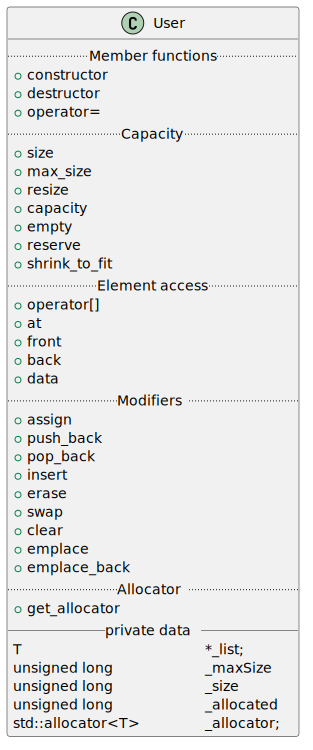
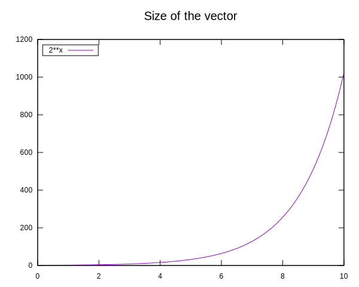

= Containers
:nofooter:
:toc: left
:sectnums:
:stylesheet: assets/my-stylesheet.css

== Subject

42: https://cdn.intra.42.fr/pdf/pdf/60315/en.subject.pdf[subject]

== Google test

In this project, I want inclure https://en.wikipedia.org/wiki/Unit_testing[unit testing] with the https://google.github.io/googletest/[Google test] framework.

== Vector

=== Resources

.cplusplus.com
* https://cplusplus.com/reference/vector/vector[`std::vector`]
* https://cplusplus.com/reference/memory/allocator/[`std::allocator`]

.The STL: on GNU/Linux
* `/usr/include/c++/12.2.0/bits/stl_vector.h`

=== Check list

.Member functions
* [x] `constructor`
* [x] `destructor`
* [ ] `operator=`

.Capacity
* [x] `size`
* [x] `max_size`
* [ ] `resize`
* [ ] `capacity`
* [x] `empty`
* [ ] `reserve`
* [ ] `shrink_to_fit`

.Element access
* [x] `operator[]`
* [x] `at`
* [x] `front`
* [x] `back`
* [ ] `data`

.Modifiers
* [x] `assign`
* [ ] `push_back`
* [x] `pop_back`
* [ ] `insert`
* [ ] `erase`
* [ ] `swap`
* [ ] `clear`
* [ ] `emplace`
* [ ] `emplace_back`

.Allocator
* [ ] `get_allocator`

=== Reallocation

[blockquote, cplusplus.com]
____
Internally, vectors use a dynamically allocated array to store their elements. This array may need to be reallocated in order to grow in size when new elements are inserted, which implies allocating a new array and moving all elements to it. This is a relatively expensive task in terms of processing time, and thus, vectors do not reallocate each time an element is added to the container.

Instead, vector containers may allocate some extra storage to accommodate for possible growth, and thus the container may have an actual capacity greater than the storage strictly needed to contain its elements (i.e., its size). Libraries can implement different strategies for growth to balance between memory usage and reallocations, but in any case, reallocations should only happen at logarithmically growing intervals of size so that the insertion of individual elements at the end of the vector can be provided with amortized constant time complexity (see push_back).
____

